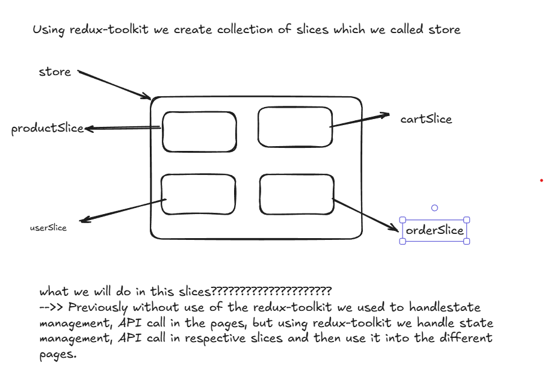
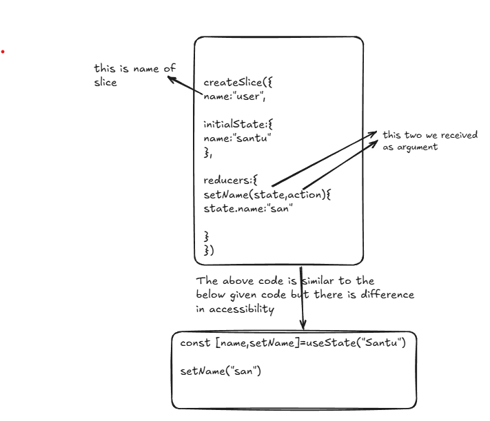
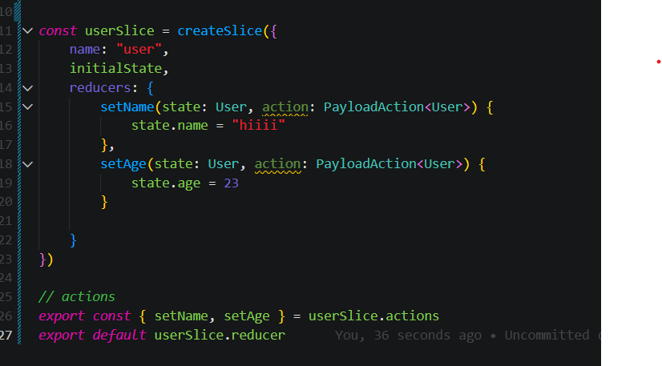

# Digital Dokan

<h2>Brief description about this project 🚀</h2>
<hr>
<p>This project is dynamic full stack project where admin can perform all the operations whereas other users like customers they can visit the sites and add the items into their cart and they have to login and register before they placed an order.
They will be provided with the different payment options. When the order is placed admin can check the order status and he/she can update the status of the order.
</p>

# Getting started 🎉

<p>This instructions will help you to set up and run the project in your local machine. 💻</p>

# Prerequisities 📝

<p>You need to have the following software installed:</p>
<ul>
  <li>Node JS 📦</li>  
</ul>

# Installation 🛠️

<p>Clone the repository and installed the dependencies: </p>

```javascript

git remote add origin git@github.com:54ntu/Client-digital-store.git
cd Client-digital-store
npm install //to install all the node_modules
npm run dev for frontend

```

# Redux-toolkit

<h3> Why to use Redux-toolkit???🤔🤔🤔🤔🤔</h3>
<p>While we want to pass data from one page to another page using prop-drilling concept, it will be difficult to pass the data from one page to another page if the number of the pages increased. We can also use session or cookies to store and pass the data from one page to another, but the problem is limited storage.
<h3>Redux-toolkit works solves this problem  but how??</h3>

We create one global state from there we can accesss the required data in multiple pages easily.

</p>

# How do we use redux-toolkit in the fronted????



# comparison between the use of useState and redux-toolkit slices



# Once the reducer is created we redux-toolkit handles the creations of actions, we do not need to write code for actions

# and we also need to export reducer


